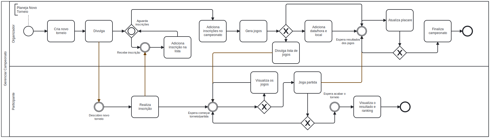

# Projeto Tenis - API

*Trabalho de Conclusão de Curso de Bacharelado em Ciência da Computação*  
*Universidade Tecnológica Federal do Paraná - UTFPR*  
*Orientador: Prof. Rafael Liberato*  
*Vinicius Simões Vieira*  
*Abril de 2025*  

<br/>
<br/>

# Sumário
* [**Introdução**](#introdução)
* [**Instalação**](#instalação)
* [**Variáveis de ambiente**](#variaveis-de-ambiente)
* [**Banco de dados**](#banco-de-dados)
* [**Processo**](#processo)
* [**Funcionalidades**](#funcionalidades)
* [**Tecnologias**](#tecnologias)
* [**Rotas**](#rotas)

<br/>
<br/>

# Introdução


O projeto Tenis é um sistema web desenvolvido como Trabalho de Conclusão de Curso (TCC) para o curso de Bacharelado em Ciência da Computação da Universidade Tecnológica Federal do Paraná (UTFPR). O sistema foi criado com o objetivo de auxiliar na gestão de campeonatos amadores de tenis, para a comunidade local de tenistas de Campo Mourão, Paraná.
O sistema foi desenvolvido com o intuito de facilitar a organização e o acompanhamento dos campeonatos, proporcionando uma plataforma onde os oraganizadores podem criar e gerenciar torneios, cadastrar jogadores, definir categorias, agendar partidas e registrar resultados. Além disso, o sistema oferece recursos para que os jogadores possam  visualizar informações sobre os campeonatos, acompanhar resultados e rankings, entre outras funcionalidades.

A motivação para o desenvolvimento deste sistema surgiu da necessidade de otimizar o processo de gestão de campeonatos de tenis, que muitas vezes é realizado de forma manual, repetitiva e cansativa, podendo ser suscetível a erros. Com a implementação do sistema, espera-se proporcionar uma experiência mais eficiente, organizada e prática tanto para os organizadores quanto para os jogadores.

O sistema foi desenvolvido utilizando tecnologias modernas e escaláveis, garantindo um desempenho eficiente e uma interface amigável. De modo que possam ser incrementadas novas funcionalidades no futuro, como a possibilidade de realizar inscrições online, gerar relatórios estatísticos e integrar com redes sociais para divulgação dos campeonatos.

Este repositório comtem apenas a API do sistema, caso queira acessar o sistema em si, acesse o [Projeto Raquete](https://github.com/Vanakaus/projetoRaquete), nele há todo o sistema e suas instruções para utiliza-lo e suas características (Funcionalidades, processos, telas, etc.). Mas para utiliza-lo é necessário ter a API instalada e funcionando, pois o sistema é apenas uma interface que processa e renderiza os dados para o usuário, o salvamento e processamenmto dos dados é realizado pela API(este repositório).


<br/>
<br/>

# Instalação

## Ambiente

Para instalar o sistema, é necessário ter o Node.js e o npm instalados em sua máquina. O sistema foi desenvolvido utilizando o Node.js como ambiente de execução para a API e o npm como gerenciador de pacotes. Caso já tenha o Node.js e o npm instalados, você pode pular esta seção [clicando aqui](#Backend).


### Instalando Node.js e o npm

Caso tenha seguido os passos de instalação do Node.js e o npm, na instalação da API, você pode pular esta seção [clicando aqui](#Backend).

### Windows

Acesse o site oficial do Node.js: [Node](https://nodejs.org/en).  
Baixe o instalador para Windows (extensão .msi).  
Execute o instalador e siga as instruções do assistente.  
Após a instalação, verifique se o Node.js foi instalado corretamente abrindo um prompt de comando (cmd) e executando os seguintes comandos:  

```console
node -v
npm -v
```
Instale o Node.js e o npm com o comando:  

```console
sudo apt-get install nodejs
sudo apt-get install npm
```

### Ubuntu (ou outras distribuições baseadas no Debian):  
Abra um terminal.
Atualize a lista de pacotes com o comando:

```console
sudo apt-get update
```

Após a instalação, verifique se o Node.js foi instalado corretamente abrindo um prompt de comando (cmd) e executando os seguintes comandos:  

```console
node -v
npm -v
```

### Fedora (ou outras distribuições baseadas no Red Hat):  
Abra um terminal.  
Use o gerenciador de pacotes dnf para instalar o Node.js e o npm:  

```console
sudo dnf install nodejs
sudo dnf install npm
```
Após a instalação, verifique se o Node.js foi instalado corretamente abrindo um prompt de comando (cmd) e executando os seguintes comandos:  

```console
node -v
npm -v
```

<br/>
<br/>


## Backend


Pelo terminal ou pelo Git Bash, execute os comandos a seguir:  

Clone o sistema:  
```console
git clone https://github.com/Vanakaus/projetoRaquete_server
```

Acesse a pasta do sistema:
```console
cd projetoRaquete/
```

Instale as dependências e as bibliotecas necessárias para o funcionamento do sistema.
```console
npm install
```

<br/>


## Variáveis de ambiente
Antes de executar o sistema, é necessário configurar as variáveis de ambiente. Para isso, abra o arquivo projetoRaquete/.env.local e altere as variáveis conforme sua necessidade:

```env
DATABASE_URL=file:./dev.db
SERVER_PORT=3300

JWT_SECRET=2661092f72e5029c179498842052e9f667df19ccd8d4722c7fa0cbe8e64371d885a9111addcf3d9593296be135bd55112ec2f1b50b811e5f15994a8f6df1be06

SECRET_KEY=projetoraquete00
SECRET_IV=projetoraquete00

STATUS_INSCRICOES_ENCERRADAS=2
STATUS_JOGOS_GERADOS=3
STATUS_EM_ANDAMENTO=4
STATUS_JOGOS_FINALIZADOS=5
STATUS_FINALIZADO=6
```

- **DATABASE_URL**: URL do banco de dados, onde a API irá se conectar. É possivel utilizar um arquivo local na máquina, este é o padrão.(Padrão local: file:./dev.db)
- **SERVER_PORT**: Porta em que a API irá rodar. O padrão é 3000, mas pode ser alterado para qualquer outra porta disponível na máquina.
- **JWT_SECRET**: Chave secreta utilizada para assinar(criptografar) os tokens JWT. É importante manter essa chave em segredo, pois ela é utilizada para autenticar os usuários. Esta chave é composta por 64 caracteres hexadecimais, e deve ser mantida em segredo. Caso deseje gerar uma chave nova, você pode utilizar os seguintes comando no terminal:
```console
node
require('crypto').randomBytes(64).toString('hex')
```
- **SECRET_KEY**: Chave secreta utilizada para criptografar os dados de login do sistema. Esta chave deve ser a mesma utilizada no frontend, caso contrário, o sistema não irá funcionar corretamente. É importante manter essa chave em segredo, pois ela é utilizada para criptografar os dados de login do sistema.
- **SECRET_IV**: Vetor de inicialização utilizado para criptografar os dados de login do sistema. Esta chave deve ser a mesma utilizada no frontend, caso contrário, o sistema não irá funcionar corretamente. É importante manter essa chave em segredo, pois ela é utilizada para criptografar os dados de login do sistema.
- **STATUS_INSCRICOES_ENCERRADAS**: ID do status de inscrições encerradas. Este status é utilizado para verificar se as inscrições estão encerradas ou não. (padrão: 2).
- **STATUS_JOGOS_GERADOS**: ID do status de jogos gerados. Este status é utilizado para verificar se os jogos foram gerados ou não. (padrão: 3).
- **STATUS_EM_ANDAMENTO**: ID do status de jogos em andamento. Este status é utilizado para verificar se os jogos estão em andamento ou não. (padrão: 4).
- **STATUS_JOGOS_FINALIZADOS**: ID do status de jogos finalizados. Este status é utilizado para verificar se os jogos foram finalizados ou não. (padrão: 5).
- **STATUS_FINALIZADO**: ID do status de torneio finalizado. Este status é utilizado para verificar se o torneio foi finalizado ou não. (padrão: 6).

Obs: As variáveis referentes ao Status são cadastradas no banco e nao devem ser alteradas futuramente, pois são utilizadas para verificar o status do torneio. Caso deseje alterar, faça isso diretamente no banco de dados.

<br/>


## Banco de dados

Para o funcionamento do sistema, é necessário ter um banco de dados PostgreSQL criado e configurado. Para criar o banco e adicionar os dados inicias, siga os passos a seguir:


### Criando o banco de dados

Para criar o banco de dados, após instalar a API e configurar as variáveis locais, execute os seguintes comandos:

```console
npm run generate
npm run migrate
```

## Dados Iniciais

Para iniciar o banco de dados, é necessário inserir os priemiros dados no banco de dados, como a lista de status e os logins dos usuários. Como não há cadastro no sistema, é necessário criar o login manualmente. Para adicionar os status, utilize o seguinte comando no terminal:

```console
npm run createStatus
```

Caso deseje alterar a lista de status, acesse o arquivo `prisma/createStatus.js` e altere a lista de status conforme sua necessidade. Mas lembre de alterar as variáveis globais do passo anterior e do sistema no frontend. Faça isso antes de executar o comando acima. 

Para adicionar uma conta de usuário, ela será administradora de uma academia, então sera necessário adicionar a academia primeiro e em seguida o usuário. Para este processo, utilize os seguintes comandos:
```console
npm run createAcad
npm run createAdmin
```

Por padrão será criado uma academia com nome `Academia Administradora` e um usuário com o login e senha `admin` que tem acesso a esta academia. Caso deseje alterar, acesse os arquivos `prisma/createAacad.js`, `prisma/createAdmin.js` e altere os dados conforme sua necessidade, lembrando que o id da academia deve ser o mesmo da `id_academia do usuario` para que o mesmo tenha acesso a ela. Faça isso antes de executar o comando acima.

Caso deseje limpar o banco de dados, utilize o seguinte comando:
    
```console
npm run deleteData
```
<br/>

## Execução

Após a instalação da API, configuração das variáveis de ambiente, e criação e inserção dos dados iniciasi, você está pronto para executar o sistema e utilizar a API do projeto Raquete. Para isso, abra um terminal e execute o seguinte comando:

```console
npm run dev
```

Após executado, é possivel verificar seu funcionanmento através de um navegador de internet qualquer, digite a URL da API no navegador (Padrão: https://localhost:3300)

<br/>
<br/>

## Frontend

Com a API devidamente instalada e configurada, parta para a instalação do sistema que pode ser encontrado neste link: [Projeto Raquete](https://www.github.com/Vanakaus/projetoRaquete).

<br/>
<br/>

# Processo

A Figura a seguir ilustra, atraves do diagama BPMN, o processo das atividades que deverão ser percorridas pelo organizador e a interação dos psrticipantes com o sistema.




A sequência de atividades do processo é a seguinte:
1. O organizador do campeonato cria um torneio no sistema, definindo as informações básicas, como nome, data e local.
2. O organizador inscreve os jogadores no torneio, atribuindo-os a categorias específicas.
3. O organizador agenda as partidas, definindo os horários e locais para cada jogo.
4. O organozador registra os resultados das partidas, salvando os resultados no sistema.
5. O organizador finaliza o torneio, verificando os resultados gerado pelo sistema.

A interação dos participantes com o sistema se limita apenas a visualização de informações, como resultados e rankings. O organizador é o único responsável por criar torneios, inscrever jogadores, agendar partidas e registrar resultados. Para o participante se inscrever no torneio, ele deve entrar em contato com o organizador, que irá realizar a inscrição no sistema.


<br/>
<br/>

# Funcionalidades
O sistema conta com uma ampla gama de funcionalidades, que podem ser divididas em três partes principais: cadastro e inscrição de classes para as academias, criação e gestão dos torneios, e visualização de resultados e rankings.

## Cadastro e Inscrição de Classes

O sistema permite o cadastro de classes para as academias, possibilitando que os organizadores do torneio inscrevam jogadores em categorias específicas. As classes podem ser definidas com base em critérios como idade, nível de habilidade e gênero, de acordo com as necessidades do usuário. Cada classe tem um nome, sigla, gênero e modalidade(Simples ou Duplas). As classes ficam atribuidas à academia que o organizador gerencia.


## Criação e Gestão de Torneios

O sistema possibilita a criação de torneios, onde o organizador pode definir as informações básicas, como nome, descrição, classes, data, local, quantidade de sets e pontuação resultante do torneio. Após criar o torneio, o organizador tem acesso as seguintes funcionalidades para gesrenciar o torneio:  


* **Inscrição de Jogadores**: Através de uma tabela criada pelo sistema o organizador pode inscrever jogadores, inserindo seus nomes e CPF`s nas suas respectivas classes. Após o documento ser preenchido, o mesmo deve ser enviado ao sistema que o lê, processa, e lista todas as inscrições feitas. O organizador deve confirmar para que o sistema salve as informações no banco de dados. Apos isto será possivel ver, caso disponível, a pontuacao, pela classe, de cada jogador, o que facilita a visualização dos cabeças de chave nas próximas etapas do torneio.

* **Geração de Chaveamento**: O sistema gera automaticamente o chaveamento de cada classe do torneio, com base nas inscrições realizadas e a quantidade de cabeças de chave que o organizador definiu. Após isso é liberado a visualização dos jogos, seja por chavemanto ou por lista de jogos, onde o organizador pode ver todos os jogos agendados, com os respectivos jogadores e horários.

* **Agendamento de Partidas**: O organizador pode agendar as partidas, definindo os horários e locais para cada jogo. O sistema permite que o organizador visualize os jogos agendados e faça alterações, se necessário.

* **Registro de Resultados**: Após a realização das partidas, o organizador pode registrar os resultados no sistema. O sistema permite que o organizador insira os resultados de cada jogo, atualizando automaticamente as informações do torneio (próximas partidas, status do torneio, etc.).

* **Finalização do Torneio**: Ao final de todas as partidas é liberado a opção de finalizar o torneio. O organizador pode verificar os resultados finais.


Durante todo o processo, o organizador tem acesso a uma interface amigável e intuitiva, podendo ser acessado de diferentes dispositivos, como computadores, tablets e smartphones, que facilita a navegação e a realização das atividades. O sistema também oferece recursos de segurança, como autenticação de usuários e criptografia de dados, garantindo a proteção das informações. Além disso, o sistema é responsivo. Além disso, é possivel compartilhar a qualquer momento o link do torneio com os jogadores, para que eles possam acompanhar os resultados e rankings em tempo real(Esta funcionalidade é explica a seguir).


## Visualização de Resultados e Rankings
O sistema permite que os jogadores visualizem os resultados e rankings dos torneios em tempo real, sem a necesidade de login ou autenticação. Os jogadores podem acessar o sistema através de um link compartilhado pelo organizador, onde poderão visualizar as informações do torneio, como:

* Informações sobre o torneio
* Jogadores inscritos
* Chaveamento
* Informações sobre as partidas
* Resultados das partidas
* Próximas partidas
* Resultados do torneio


Além disto os jogadores podem visualizar o ranking de cada classe, com as pontuações dos jogadores, a qualkquer momento, podendo ver suas respectivas pontuações e a posição em que se encontram no ranking.


</br>
</br>


# Tecnologias:

A API do sistema foi desenvolvida utilizando as seguintes tecnologias:

- [Node.Js](https://nodejs.org/en/about)
- [express](https://www.npmjs.com/package/express)
- [Prisma ORM](https://www.prisma.io/)
- [TypeScript](https://www.typescriptlang.org)
- [Neon](https://neon.tech/)
- [jsonwebtoken](https://www.npmjs.com/package/jsonwebtoken)
- [bcrypt](https://www.npmjs.com/package/bcrypt)


O sistema foi desenvolvido utilizando as seguintes tecnologias:

- [Next.js](https://nextjs.org)
- [React.js](https://reactjs.org)
- [TypeScript](https://www.typescriptlang.org)
- [ESLint](https://eslint.org)
- [Tailwind CSS](https://tailwindcss.com)
- [Material UI](https://mui.com)
- [ExcelJs](https://github.com/exceljs/exceljs)
- [Yup](https://github.com/jquense/yup)


<br/>
<br/>

# Rotas

Esta API do sistema possui diversas rotas para realizar a comunicação entre o frontend e o backend. As rotas estão organizadas em grupos, cada um com as rotas relacionadas a uma área do sistema. Para acessar uma rota qualquer utilize a seguinte semântica, URL da API + grupo + rota, em determinadas rotas é necessário passar o id do objeto que deseja acessar, para saber veja a documentação da rota abaixo. Aqui está um exemplo de como acessar uma rota qualquer:

```console
http://localhost:3300/partidas/listar?id_torneio=dd0891a5-e81b-4fe7-ba0e-ff5a36b0943e
```

Todas as rotas possuem campos padrões no JSON de reposta, que são `status`, `message`. Ondo o status tem o valor `error` ou `success`, o message é uma mensagem de erro ou sucesso. E existem rota que necessitam do token de autenticação, ele é enviado como um header com o nome `x-access-token`, para saber quais rotas precisam dele verifique a documentação a seguir. A seguir estão as rotas disponíveis no sistema, com uma breve descrição, entrada e resultados de cada uma delas e organizadas, tambem, em grupos:


### Usuários - `/users`

- `/login`: Realiza o login do usuário no sistema, retornando um token de autenticação.
    - **Método**: POST
    - **Headers**: Nenhum
    - **Parâmetros**: Nenhum
    - **Entrada**: JSON com os campos `login` e `senha`, com a senha criptografada com a criptografia AES-256-CBC, utilizando a chave e o vetor de inicialização definidos nas variáveis de ambiente.
    - **Resultado**: JSON com o token de autenticação(`JWT`) e as informações do usuário, que tem prazo de validade de 1 hora. O token deve ser enviado em todas as requisições que exigem autenticação, no cabeçalho da requisição, no campo `x-accass-token`.

<br/>

- `/verificaJWT`: Verifica se o token de autenticação é válido e retorna essa informação.
    - **Método**: GET
    - **Headers**: `x-accass-token` com o token de autenticação.
    - **Parâmetros**: Nenhum
    - **Entrada**: Nenhum
    - **Resultado**: JSON com `status` e `menssagem`, onde o status pode ser `error` ou `success`, e a mensagem é uma mensagem de erro ou sucesso.

<br/>
<br/>

### Classes - `/classes`

- `/listar`: Lista todas as classes cadastradas no sistema.
    - **Método**: GET
    - **Headers**: `x-accass-token` com o token de autenticação.
    - **Parâmetros**: Nenhum
    - **Entrada**: Nenhum
    - **Resultado**: JSON com um array `classes` contendo a lista de classes cadastradas no sistema e ligados a academia do usuário, onde cada classe possui os campos `id`, `nome`, `sigla`, `masculino`, `misto` e `dupla`.

<br/>

- `/criar`: Cadastra uma nova classe no sistema.
    - **Método**: POST
    - **Headers**: `x-accass-token` com o token de autenticação.
    - **Parâmetros**: Nenhum
    - **Entrada**: JSON com os campos `nome`, `sigla`, `masculino`, `misto` e `dupla`.
    - **Resultado**: JSON com `classe`, onde a classe é o objeto criado, com os campos `id`, `nome`, `sigla`, `masculino`, `misto` e `dupla`.

<br/>

- `/atualizar`: Atualiza uma classe cadastrada no sistema.
    - **Método**: PATCH
    - **Headers**: `x-accass-token` com o token de autenticação.
    - **Parâmetros**: Nenhum
    - **Entrada**: JSON com os campos `id`, `nome`, `sigla`, `masculino`, `misto` e `dupla`.
    - **Resultado**: JSON com `classe`, onde a classe é o objeto atualizado, com os campos `id`, `nome`, `sigla`, `masculino`, `misto` e `dupla`.

<br/>

- `adicionarClasseRanking`: Adiciona uma classe ao ranking de uma academia.
    - **Método**: POST
    - **Headers**: `x-accass-token` com o token de autenticação.
    - **Parâmetros**: Nenhum
    - **Entrada**: JSON com os campos `iClasse`, `idRanking`.
    - **Resultado**: JSON com `classeRanking`, onde a classe é o objeto criado para linkar uma classe ao ranking, com os campos `id`, `id_classe` e `id_Ranking`.

<br/>
<br/>


### Ranking - `/ranking`

- `/listar`: Lista todos os rankings cadastrados no sistema.
    - **Método**: GET
    - **Headers**: `x-accass-token` com o token de autenticação (opcional) - o token possui o id da academia que o usuário tem acesso, caso não seja enviado o token, é necessário enviar este dado pelos parâmetros da URL.
    - **Parâmetros**: `id_academia` (opcional) - id da academia que deseja listar os rankings, pode ser subistituido pelo token de autenticação.
    - **Entrada**: Nenhum
    - **Resultado**: JSON com um array `ranking` contendo a lista de rankings cadastrados no sistema, que são de autoria da academia em questão. Cada ranking possui os campos `id` e `nome`.

<br/>

- `/listarClasses`: Lista todas as classes associadas ao ranking.
    - **Método**: GET
    - **Headers**: Nenhum
    - **Parâmetros**: `id_ranking` - id do ranking que deseja listar as classes.
    - **Entrada**: Nenhum
    - **Resultado**: JSON com um array `rankingClasses` contendo a lista de classes associadas ao ranking, onde cada classe possui os campos `id`, `id_ranking`, `classe` - com os campos `id`, `nome`, `sigla`, `masculino`, `misto` e `dupla`.

<br/>

- `/criar`: Cadastra um novo ranking no sistema.
    - **Método**: POST
    - **Headers**: `x-accass-token` com o token de autenticação.
    - **Parâmetros**: Nenhum
    - **Entrada**: JSON com os campos `nome` e `classes`, que é um array de id`s de classes que deseja adicionar ao ranking.
    - **Resultado**: JSON com `ranking`, onde o ranking é o objeto criado, com os campos `id`, `nome` e `id_academia`.

<br/>

- `/ranking`: Rankea os jogadores de uma classe, com base nos resultados das partidas do ano corrente, caso nao haja resultados busca do ano passado.
    - **Método**: GET
    - **Headers**: Nenhum
    - **Parâmetros**: `id_classeRanking` - id da classe de um ranking que deseja rankear os jogadores.
    - **Entrada**: Nenhum
    - **Resultado**: JSON com array `ranking`, onde cada ranking possui os campos `id`, `tenista` - com os campos `nome` e `cpf` - `pontuacao`. O ranking é ordenado pela pontuação, do maior para o menor.

<br/>
<br/>


### Torneios - `/torneios`

- `/criar`: Cria um novo torneio no sistema.
    - **Método**: POST
    - **Headers**: `x-accass-token` com o token de autenticação.
    - **Parâmetros**: Nenhum
    - **Entrada**: JSON com os campos `id_ranking`, `nome`, `descricao`, `local`, `sets`, `modalidade`, `pontuacao`, `classes`, `dataInicio` e `dataFim`. Onde o campo `modalidade` é um objeto com os campos `simples` e `duplas`, o campo `pontuacao` é um objeto com os campos `participacao`, `r32`, `r16`, `r8`, `r4`, `r2`, `r1` e `vencedor`, e o campo `classes` é um array de id`s de classes que deseja adicionar ao torneio.
    - **Resultado**: JSON com `torneio`, onde o torneio é o objeto criado, com os campos `id`, `nome`, `descricao`, `local`, `sets`, `simples`, `duplas`, `dataInicio` e `dataFim`.

<br/>

- `/atualizarTorneio`: Atualiza um torneio cadastrado no sistema.
    - **Método**: PATCH
    - **Headers**: `x-accass-token` com o token de autenticação.
    - **Parâmetros**: Nenhum
    - **Entrada**: JSON com os campos `id`, `nome`, `descricao`, `local`, `sets`, `modalidade`, `pontuacao`, `classesDeleta`, `classesAdiciona`, `dataInicio` e `dataFim`. Onde o campo `modalidade` é um objeto com os campos `simples` e `duplas`, o campo `pontuacao` é um objeto com os campos `participacao`, `r32`, `r16`, `r8`, `r4`, `r2`, `r1` e `vencedor`, e os campos `classesDeleta` e `classesAdiciona` são arrays de id`s de classes que deseja adicionar ou remover do torneio.
    - **Resultado**: JSON com `torneio`, onde o torneio é o objeto atualizado, com os campos `id`, `nome`, `descricao`, `local`, `sets`, `simples`, `duplas`, `dataInicio` e `dataFim`.

<br/>

- `/ler`: Lê um torneio cadastrado no sistema.
    - **Método**: GET
    - **Headers**: Nenhum
    - **Parâmetros**: `id` - id do torneio que deseja ler.
    - **Entrada**: Nenhum
    - **Resultado**: JSON com `torneio`, onde o torneio é o objeto lido, com os campos `id`, `nome`, `descricao`, `local`, `sets`, `simples`, `duplas`, `dataInicio` e `dataFim`, `status`: com os campos `id` e `nome` - `pontuacoes`: com os campos `participacao`, `r32`, `r16`, `r8`, `r4`, `r2`, `r1` e `vencedor` - `classes`: com os campos `id`, `cabecasChave`, `classeRanking`: com os campos `id`, `nome`, `sigla`, `masculino`, `misto` e `dupla` - e `_count`: com a quantidade de jogadores inscritos na classe.

<br/>

- `/listar`: Lista todos os torneios associados a uma academia que estão cadastrados no sistema.
    - **Método**: GET
    - **Headers**: `x-accass-token` com o token de autenticação.
    - **Parâmetros**: Nenhum
    - **Entrada**: Nenhum
    - **Resultado**: JSON com um array `torneios` contendo a lista de torneios cadastrados no sistema, onde cada torneio possui os campos `id`, `nome`, `descricao`, `local`, `sets`, `simples`, `duplas`, `dataInicio` e `dataFim`, `status`: com os campos `id` e `nome` - `pontuacoes`: com os campos `participacao`, `r32`, `r16`, `r8`, `r4`, `r2`, `r1` e `vencedor` - e `ClasseTorneio`: com os campos `id`, `cabecasChave`, `classeRanking`: com os campos `id`, `nome`, `sigla`, `masculino`, `misto` e `dupla` - e `_count`: com a quantidade de jogadores inscritos na classe.

<br/>

- `/listarStatus`: Lista todos os status cadastrados no sistema.
    - **Método**: GET
    - **Headers**: Nenhum
    - **Parâmetros**: Nenhum
    - **Entrada**: Nenhum
    - **Resultado**: JSON com um array `status` contendo a lista de status cadastrados no sistema, onde cada status possui os campos `id` e `nome`.

<br/>

- `/listarResultado`: Lista todos os resultados de um torneio.
    - **Método**: GET
    - **Headers**: Nenhum
    - **Parâmetros**: `id_torneio` - id do torneio que deseja listar os resultados.
    - **Entrada**: Nenhum
    - **Resultado**: JSON com um array `resultados` contendo a lista de resultados do torneio, onde cada resultado possui os campos `id`, `classe`: com os campos `id`, `nome`, `sigla`, `masculino`, `misto` e `dupla` - `inscricao`: com os campos `id`, o array `tenistasInscricao`: com o campo `tenistaAcademia.tenista.nome` - e `pontuacaoRanking`: com os campos `posicao` e `pontuacao`.

<br/>

- `/gerarResultados`: Gera os resultados de um torneio.
    - **Método**: GET
    - **Headers**: `x-accass-token` com o token de autenticação.
    - **Parâmetros**: `id_torneio` - id do torneio que deseja gerar os resultados.
    - **Entrada**: Nenhum
    - **Resultado**: JSON com um array `resultados` contendo a lista de resultados do torneio, agrupados pelas classes e cada grupo ordenado pela pontuação em ordem crescente , onde cada resultado possui os campos `id`, `classeRanking`: com o campo `Classe`: com os campos `id`, `nome`, `sigla`, `masculino`, `misto` e `dupla` - `pontuacao`: com os campos `posicao`, `pontuacao` e `inscricao`: com os campos `id`, `tenista1` e `tenista2`.

<br/>

- `/finalizarTorneio`: Finaliza um torneio.
    - **Método**: POST
    - **Headers**: `x-accass-token` com o token de autenticação.
    - **Parâmetros**: Nenhum
    - **Entrada**: JSON com os campos `id_torneio` e `resultados`, onde o campo `resultados` é um array de objetos com os campos `posicao`, `pontuacao` e `inscricao`: com os campos `id`, `tenista1` e `tenista2`.
    - **Resultado**: Apenas o status e a mensagem de sucesso ou erro padrão em todas as respostas das rotas.

<br/>
<br/>


### Inscrições - `/inscricoes`

- `/adicionar`: Adiciona uma lista de inscrições num determinado torneio.
    - **Método**: POST
    - **Headers**: `x-accass-token` com o token de autenticação.
    - **Parâmetros**: Nenhum
    - **Entrada**: JSON com os campos `id_torneio` e o array `inscricaoClasse`: com os campos `id_classeTorneio`, `duplas` e o array `inscricaoJogador`: com os campos `nome` e `cpf`.
    - **Resultado**: JSON com os campos `sucesso` e `falhas`: que são booleans para sinalizar se houve sucesso ou falhas na inscrição, e o array `inscricoes`: com os campos `jogador`, `sucesso`, `repetido` e mensagem.

<br/>

- `/listar`: Lista todas as inscrições de um torneio.
    - **Método**: GET
    - **Headers**: Nenhum
    - **Parâmetros**: `id_torneio` - id do torneio que deseja listar as inscrições.
    - **Entrada**: Nenhum
    - **Resultado**: JSON com um array `inscricoes` contendo a lista de inscrições do torneio, onde cada inscrição possui os campos `id`, `pontuacao`e o array `tenistaInscricao`: com o campo `tenistaAcademia.tenista`: com os campos `nome` e `cpf` -  e `classeTorneio`: com o campo: `classeRanking.classe.sigla`.

<br/>
<br/>

### Partidas - `/partidas`

- `/gerarChaves`: Gera o chaveamento de uma classe de um torneio.
    - **Método**: POST
    - **Headers**: `x-accass-token` com o token de autenticação.
    - **Parâmetros**: Nenhum
    - **Entrada**: JSON com os campos `id_torneio`, `id_classeTorneio` e `numCabecas`.
    - **Resultado**: JSON com oscampos `torneio.status`: com os campos `id` e `nome` - e um array `partidas` contendo a lista de partidas geradas, onde cada partida possui os campos `id`, `chave` e o array `inscricoes`: com os campos `id`, `pontuacao`, `ordem`, e o array `tenistaInscricao`: com o campo `tenistaAcademia.tenista.nome`.

<br/>

- `/limparChave`: Limpa o chaveamento de uma classe de um torneio.
    - **Método**: POST
    - **Headers**: `x-accass-token` com o token de autenticação.
    - **Parâmetros**: Nenhum
    - **Entrada**: JSON com os campos `id_torneio` e `id_classeTorneio`.
    - **Resultado**: JSON com os campos `torneio.status`: com os campos `id` e `nome` - `chave`, com  a quantidade de partidas deletadas.

<br/>

- `/listar`: Lista todas as partidas de um torneio.
    - **Método**: GET
    - **Headers**: Nenhum
    - **Parâmetros**: `id_torneio` - id do torneio que deseja listar as partidas.
    - **Entrada**: Nenhum
    - **Resultado**: JSON com um array `partidas` contendo a lista de partidas do torneio, onde cada partida possui os campos `id`, `chave`, `id_vencedor`, `dataPartida`, `horaPartida`, `local`, `sets`: com os campos `id`, `tiebreak`, `pontTen1` e `pontTen2` - e o array `inscricaoPartida`: com os campos `ordem`, `inscricao`: com os campos `id`, `tenistasInscricao`: com o campo `tenistaAcademia.tenista.nome` - e `classeTorneio`: com o campo: `classeRanking.classe.sigla`.

<br/>

- `/atualizarDados`: Atualiza os dados de uma partida.
    - **Método**: PATCH
    - **Headers**: `x-accass-token` com o token de autenticação.
    - **Parâmetros**: Nenhum
    - **Entrada**: JSON com o array `novosDados`, onde cada objeto possui os campos `id`, `dataPartida`, `horaPartida`, `local` e `id_partida`.
    - **Resultado**: JSON com os arrays `partidasAtualizadas` e `partidasNaoAtualizadas`, onde cada array possui os campos `id`, `classe`, `data`, `hora`, `local` e `resposta`.

<br/>

- `/atualizarPlacar`: Atualiza o placar de uma partida.
    - **Método**: PATCH
    - **Headers**: `x-accass-token` com o token de autenticação.
    - **Parâmetros**: Nenhum
    - **Entrada**: JSON com os campos `id_torneio` e o array `novosPlacares`, onde cada objeto possui os campos `id`, e o array `sets`: com os campos `id`, `tiebreak`, `pontTen1` e o array `placar`: com os dois valores do placar.
    - **Resultado**: JSON com os campos `torneio`, e os arrays `partidasAtualizadas`, `partidasNaoAtualizadas` e `novasPartidas`, onde cada array possui os campos `id`, e `sets`. Os arrays `partidasAtualizadas` e `novasPartidas` também possuem os campos `id_vencedor`, `classe`, `inscricao1` e `inscricao2`: com os campos `id`, `tenistas1` e `tenistas2`. E por fim o array `novasPartidas` tabém possue o campo `chave`.

<br/>